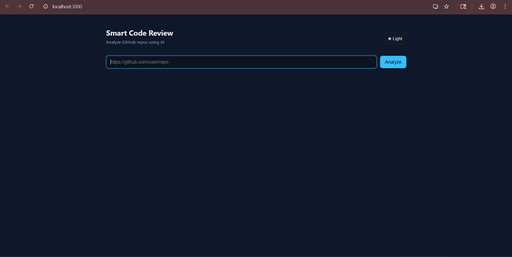
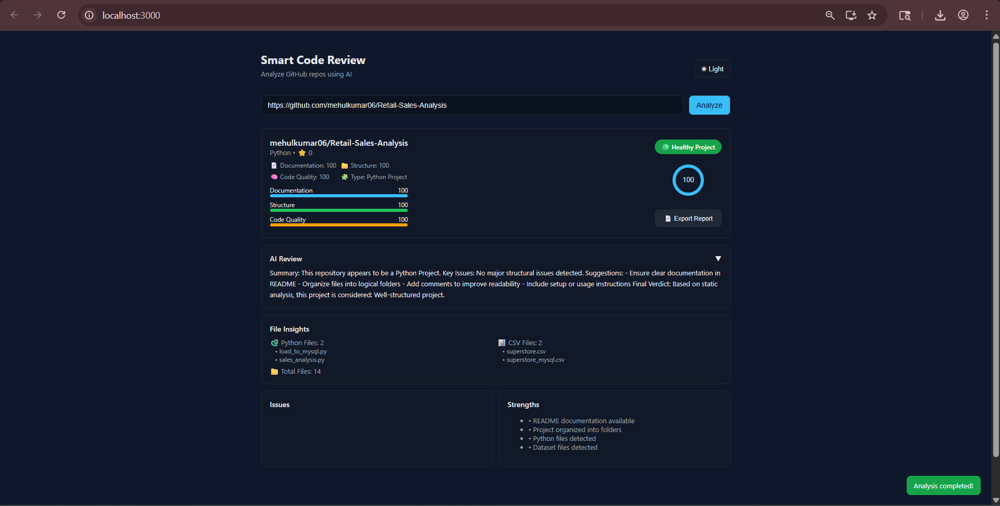
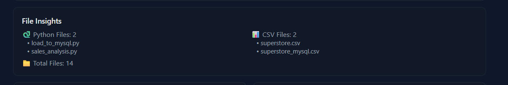
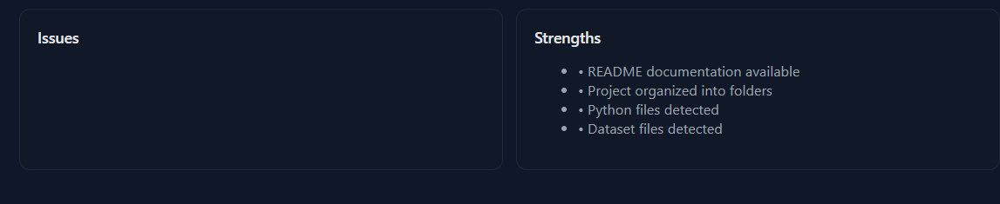
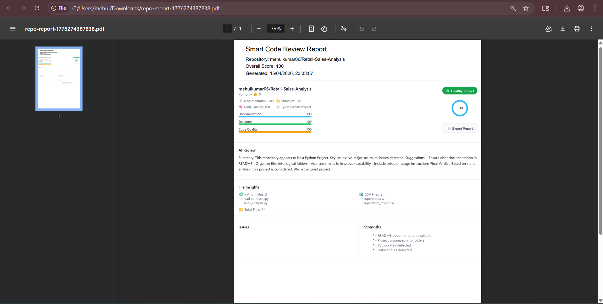

# 🚀 Smart Code Review Platform

An AI-powered GitHub Repository Analyzer that evaluates repository structure, detects issues, provides intelligent insights, and generates downloadable PDF reports.

Built as a **full-stack developer tool** to simulate real-world code review workflows.

---

# 🌐 Live Demo (Coming Soon)

Frontend: _To be deployed_  
Backend: _To be deployed_

---

# 📸 Screenshots

## 🏠 Homepage

 

---

## 📊 Repository Analysis Dashboard



---

## 📁 File Insights



---

## ⚠️ Issues & Severity Detection



---

## 📄 PDF Report Export



---

# ✨ Features

## 🔍 GitHub Repository Analysis

- Analyze any public GitHub repository
- Fetch repository metadata
- Detect language and project type
- Recursive file scanning

---

## 📁 Smart File Insights

Automatically detects:

- Python files (.py)
- JavaScript files (.js)
- CSV datasets (.csv)
- Jupyter notebooks (.ipynb)
- JSON files

Displays:

- File counts
- File names
- File previews
- Folder structure insights

---

## ⚠️ Intelligent Issue Detection

Severity-based issue system:

- 🔴 High Severity  
- 🟡 Medium Severity  
- 🟢 Low Severity  

Detects:

- Missing README
- Poor folder structure
- Too many root files
- Documentation issues

---

## 📊 Project Health Meter

Visual indicators:

- Overall Score (0–100)
- Health Status
- Category Scores:
  - Structure
  - Documentation
  - Code Quality

---

## 🧠 AI Code Review System

Generates:

- Repository Summary
- Improvement Suggestions
- Code Quality Feedback
- Final Verdict

Includes fallback review when AI quota is unavailable.

---

## 📄 Export to PDF

Generate professional reports including:

- Repository details
- Project score
- Issues detected
- File insights
- AI review summary
- Timestamp

---

## 🌙 Dark Mode Support

Modern UI with:

- Light Mode
- Dark Mode
- Improved contrast styling
- Interactive buttons

---

## 🕘 Analysis History

Stores previously analyzed repositories for quick access.

---

# 🛠️ Tech Stack

## Frontend

- React.js
- JavaScript
- HTML5
- CSS3

Libraries Used:

- Axios
- html2canvas
- jsPDF

---

## Backend

- Node.js
- Express.js

---

## APIs & Services

- GitHub REST API
- OpenAI API (optional AI review)

---

# 🧪 Tested Repositories

This system was tested using real-world repositories:

### 📊 Data Analysis Project

Retail Sales Analysis

Includes:

- Python scripts
- CSV datasets
- Data analysis workflow

---

### 🛒 Full Stack Project

Shop Swift

Includes:

- JavaScript frontend
- Backend APIs
- Folder-based structure

---

### 🎬 Frontend UI Project

Netflix Clone

Includes:

- UI components
- JavaScript frontend logic

---

# ⚙️ Installation Guide

## Clone Repository

```bash
git clone https://github.com/mehulkumar06/smart-code-review-platform.git
cd smart-code-review-platform

Backend Setup

cd backend

npm install

npm run dev

Backend runs on:
    http://localhost:5000

Frontend Setup

cd frontend

npm install

npm start

Frontend runs on:
    http://localhost:3000

🔑 Environment Variables

Create .env inside:

backend/

Add:

GITHUB_TOKEN=your_github_token
OPENAI_API_KEY=your_openai_key_optional
PORT=5000

📊 Project Architecture

smart-code-review-platform/
│
├── frontend/
│   ├── components/
│   ├── pages/
│   ├── styles/
│   └── App.js
│
├── backend/
│   ├── controllers/
│   ├── services/
│   ├── routes/
│   └── server.js
│
├── screenshots/
│
└── README.md

🎯 Key Highlights

✔ Full-stack application
✔ GitHub API integration
✔ Recursive repository scanning
✔ Severity-based issue detection
✔ AI-powered insights
✔ PDF export functionality
✔ Responsive UI with dark mode

🚀 Future Improvements

Planned enhancements:

Live deployment
Multi-repository comparison
Advanced code quality metrics
Multi-page PDF reports
GitHub authentication
Performance analysis tools
